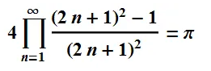

# 2025-1-파이썬 수업
노정원

목표:
1. 머신러닝을 잘 하기위한 파이썬 프로그래밍
2. 객체지향개념을 연습하는 파이썬 프로그래밍
3. ADP, ADsP 실기시험을 위한 파이썬 프로그래밍
4. 코딩테스트 연습

## 깃허브와 파이참의 연동실험
파이참의 파일 -> 버전 관리에 있는 프로젝트 -> github 선택 
-> 원하는 repository 선택 -> 원하는 디렉토리 선택 -> **복제** 선택

## 변수와 자료형
- 정수 int
- 실수 float
- 문자열 str
- 논리형 bool

## 리스트
한개의 변수에 여러값을 할당
- 인덱싱, 슬라이싱
- 리스트의 연산(덧셈, 곱셈, append, insert, remove)

## 조건문
- if, elif, else

## 반복문
- for
- while

## project 1 : 파이값 구하기
파이값을 구하고 그래프 그리기
